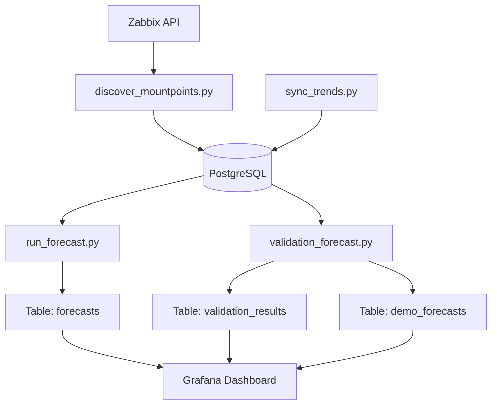

# 📊 Zabbix Disk Capacity Forecast

Сервис для **автоматического прогнозирования заполнения файловых систем** на основе данных из **Zabbix**.

Проект автоматически:

1. 🔍 Находит все mountpoint'ы в Zabbix  
2. 📥 Загружает и агрегирует исторические тренды (до дневных значений)  
3. 🧠 Строит прогноз заполнения с помощью **NeuralProphet** (линейный рост, без сезонности)  
4. ✅ Валидирует точность модели на исторических данных  
5. 📈 Сохраняет прогнозы на **90 дней** вперед  
6. 📊 Позволяет визуализировать результат в **Grafana**

Pipeline запускается **раз в сутки через GitLab CI**.

---

# 🏗 Архитектура

### Архитектурная схема



### Описание этапов:

1. **Discover (`discover_mountpoints.py`)**: 
   - Сканирует активные хосты в Zabbix.
   - Ищет пары items `vfs.fs.size[/<path>,used]` и `vfs.fs.size[/<path>,total]`.
   - Сохраняет или обновляет список целевых дисков в таблице `prediction_targets`.

2. **Sync (`sync_trends.py`)**: 
   - Забирает сырые тренды (`trend.get`) из Zabbix за последний год.
   - **Агрегирует** часовые/минутные данные до **дневных** значений (avg/min/max).
   - Сохраняет агрегированные данные в `zabbix_trends`.
   - Обновляет актуальный размер диска в `disk_total`.

3. **Forecast (`run_forecast.py`)**: 
   - Строит основные прогнозы на **90 дней** вперед.
   - Использует **NeuralProphet** с линейным ростом (`growth='linear'`) и **отключенной сезонностью** (yearly/weekly/daily = False).
   - Автоматически детектирует и исключает аномалии (резкие очистки диска >10%).
   - Результаты сохраняются в таблицу `forecasts`.

4. **Validation (`validation_forecast.py`)**: 
   - Оценивает качество модели ("Backtesting").
   - Обучается на данных, обрезанных на 30 дней назад.
   - Прогнозирует на эти 30 дней и сравнивает с реальностью.
   - Игнорирует диски, которые не растут (статичные или уменьшающиеся).
   - Сохраняет метрики ошибок в `validation_results` и полные данные сравнения в `demo_forecasts`.

---

# ⚙️ Требования

### Python

Рекомендуется Python **3.9+**

### Python зависимости

Для работы требуется установка библиотек для ML и работы с БД:

```bash
pip install pandas psycopg2-binary requests neuralprophet torch
```

> **Примечание:** Скрипты используют `ProcessPoolExecutor` для параллельного прогнозирования, что значительно ускоряет обработку большого количества дисков.

---

# 🗄 Подготовка базы данных

Создайте PostgreSQL базу и выполните SQL ниже.

## Таблица: `prediction_targets`

Список дисков для прогнозирования.

```sql
CREATE TABLE IF NOT EXISTS public.prediction_targets
(
    itemid text PRIMARY KEY,
    total_itemid text NOT NULL,
    host text NOT NULL,
    name text NOT NULL, -- Mount point path
    alert_threshold_pct double precision DEFAULT 90.0,
    enabled boolean DEFAULT true,
    last_discovered_at timestamp with time zone DEFAULT now()
);
```

## Таблица: `zabbix_trends`

Хранит **агрегированные дневные** значения использования дисков.

```sql
CREATE TABLE IF NOT EXISTS public.zabbix_trends
(
    itemid text NOT NULL,
    clock bigint NOT NULL, -- Timestamp start of the day
    value_avg double precision,
    value_min double precision,
    value_max double precision
);

CREATE UNIQUE INDEX idx_zabbix_trends_itemid_clock
ON public.zabbix_trends (itemid, clock);
```

## Таблица: `disk_total`

Хранит общий размер диска (обновляется раз в сутки).

```sql
CREATE TABLE IF NOT EXISTS public.disk_total
(
    used_itemid bigint PRIMARY KEY,
    total_itemid bigint NOT NULL,
    total_bytes numeric NOT NULL,
    updated_at timestamp with time zone DEFAULT now()
);
```

## Таблица: `forecasts`

Основная таблица прогнозов (на 90 дней).

```sql
CREATE TABLE IF NOT EXISTS public.forecasts
(
    itemid text NOT NULL,
    run_id text,
    forecast_run_at timestamp with time zone NOT NULL,
    ds timestamp with time zone NOT NULL,
    yhat double precision,       -- Predicted value
    yhat_lower double precision, -- Lower bound (quantile 0.1)
    yhat_upper double precision, -- Upper bound (quantile 0.9)
    threshold_pct double precision,
    fill_date_est timestamp with time zone -- Estimated date when threshold is reached
);

CREATE INDEX idx_forecasts_itemid_runat ON public.forecasts (itemid, forecast_run_at DESC);
```

## Таблица: `validation_results`

Результаты валидации модели (ошибка в днях).

```sql
CREATE TABLE IF NOT EXISTS public.validation_results
(
    itemid text PRIMARY KEY,
    error_days double precision, -- Error in days (absolute difference / avg daily growth)
    disk_name text,
    validated_at timestamp with time zone DEFAULT now(),
    is_invalid_growth boolean DEFAULT false -- True if disk is not growing
);
```

## Таблица: `demo_forecasts`

Детальные данные валидации (прогноз vs факт по дням).

```sql
CREATE TABLE IF NOT EXISTS public.demo_forecasts
(
    itemid text,
    ds timestamp with time zone,
    yhat double precision,
    actual_y double precision,
    run_id text,
    created_at timestamp with time zone DEFAULT now()
);

CREATE INDEX idx_demo_itemid_ds ON public.demo_forecasts (itemid, ds);
```

---

# 🔑 Переменные окружения

Все настройки передаются через **environment variables**.

```bash
# Zabbix Connection
ZABBIX_URL=https://zabbix.example.com/api_jsonrpc.php
ZABBIX_API_TOKEN=xxxxxxxxxxxx

# Database Connection
DB_DBNAME=zabbix_forecast
DB_USER=postgres
DB_PASSWORD=password
DB_HOST=localhost
DB_PORT=5432
```

---

# 🔎 Скрипты

## discover_mountpoints.py

🔍 **Поиск дисков.**
- Подключается к Zabbix API.
- Фильтрует только активные хосты.
- Парсит ключи `vfs.fs.size[...]`.
- Сохраняет пары `used`/`total` в БД. Если диск уже есть, обновляет его метаданные и timestamp обнаружения.

## sync_trends.py

📥 **Синхронизация данных.**
- Загружает тренды из Zabbix за последние 365 дней.
- **Агрегация:** Группирует данные по дням (среднее, мин, макс за сутки).
- **Оптимизация:** Использует `ThreadPoolExecutor` для параллельного опроса Zabbix.
- Удаляет старые данные из БД (> 365 дней).
- Обновляет текущий объем диска (`disk_total`) на основе последних 7 дней трендов.

## run_forecast.py

🧠 **Основное прогнозирование.**
- Использует **NeuralProphet**.
- **Настройки модели:**
  - `growth='linear'`
  - `seasonality=False` (год/неделя/день отключены для стабильности на коротких горизонтах).
  - `quantiles=[0.1, 0.9]` для оценки неопределенности.
- **Preprocessing:** Detects cleanups (drops > 10% of total size) and removes anomaly points from training data.
- **Parallelism:** Uses `ProcessPoolExecutor` (up to 8 workers) to forecast multiple disks simultaneously.
- Saves results to `forecasts`.

## validation_forecast.py

✅ **Валидация модели.**
- Запускается отдельно для оценки качества.
- **Логика:**
  1. Берет историю до `T - 30 days`.
  2. Строит прогноз на 30 дней вперед.
  3. Сравнивает прогноз с реальными данными, которые уже появились в Zabbix.
- **Фильтрация:** Если диск не растет (или уменьшается), он помечается как `is_invalid_growth` и исключается из расчета средних метрик ошибки.
- Сохраняет итоговую ошибку (в днях) в `validation_results`.
- Сохраняет подневное сравнение в `demo_forecasts`.

---

# 🚀 GitLab CI Pipeline

Файл `.gitlab-ci.yml` должен содержать следующие стадии. Рекомендуется запускать `validation` реже (например, раз в неделю) или после `forecast`.

```yaml
stages:
  - discover
  - sync
  - forecast
  - validate

variables:
  PYTHON_IMAGE: "python:3.9-slim"

before_script:
  - pip install pandas psycopg2-binary requests neuralprophet torch

discover_mountpoints:
  stage: discover
  script:
    - python discover_mountpoints.py

sync_trends:
  stage: sync
  script:
    - python sync_trends.py

run_forecast:
  stage: forecast
  script:
    - python run_forecast.py

validate_model:
  stage: validate
  script:
    - python validation_forecast.py
  only:
    - schedules # Запускать по расписанию, например, раз в неделю
```

---

# 📈 Grafana

Для визуализации используйте **Grafana Dashboard**.

Основные панели:
1. **Forecast Chart:** График `yhat` (прогноз) с облаком `yhat_lower`/`yhat_upper` и реальными точками.
2. **Fill Date:** Дата достижения порога (например, 90%).
3. **Validation Error:** График ошибки модели (из таблицы `validation_results`).

Datasource: **PostgreSQL**

---

# 🧠 Особенности модели NeuralProphet

В данной реализации используется упрощенная конфигурация **NeuralProphet** для повышения стабильности прогнозов на инфраструктурных данных:

- **Сезонность отключена:** `yearly`, `weekly` и `daily` сезонности выключены. Практика показала, что для дисковых квот и логов линейный тренд часто точнее, чем попытки уловить сложные циклы, которые могут шуметь.
- **Линейный рост:** `growth='linear'`. Предполагается, что заполнение диска — процесс накопительный.
- **Квантили:** Используются `[0.1, 0.9]` для построения доверительного интервала.
- **Обработка аномалий:** Скрипт самостоятельно находит резкие падения объема (очистка логов/бэкапов) и выбрасывает эти точки из обучения, чтобы модель не "училась" на том, что диск внезапно стал пустым.
- **Параллелизм:** Прогнозирование разбито на процессы (`ProcessPoolExecutor`), так как NeuralProphet (PyTorch) требует ресурсов CPU. Это позволяет обрабатывать сотни дисков за минуты.
```
