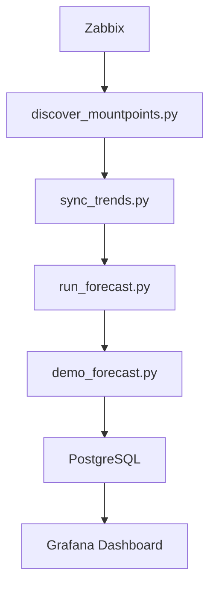

# 📊 Zabbix Disk Capacity Forecast

Сервис для **ежедневного прогнозирования заполнения файловых систем** на основе данных из **Zabbix**.

Проект автоматически:

1. 🔍 Находит все mountpoint'ы в Zabbix  
2. 📥 Загружает исторические тренды использования дисков  
3. 🧠 Строит прогноз заполнения с помощью **NeuralProphet**  
4. 📈 Сохраняет прогноз на **30 / 60 / 90 дней**  
5. 📊 Позволяет визуализировать результат в **Grafana**

Pipeline запускается **раз в сутки через GitLab CI**.

---

# 🏗 Архитектура

### Архитектурная схема



### Описание этапов:

1. **Discover**: 
    - Сканирует активные хосты и находит все mountpoints.
    - Добавляет/обновляет информацию о дисках в таблицу `prediction_targets`.
   
2. **Sync**: 
    - Синхронизирует данные по трендам использования дисков в базу данных PostgreSQL.
   
3. **Forecast**: 
    - Строит прогнозы на 90 дней с использованием **NeuralProphet**.
    - Сохраняет прогнозы в таблицу `forecasts`.

4. **Demo**: 
    - Генерирует демо-прогнозы и сравнивает их с реальными значениями.
    - Результаты сохраняются в таблицу `demo_forecasts`.

---

# ⚙️ Требования

### Python

Рекомендуется Python **3.9+**

### Python зависимости

```bash
pip install pandas psycopg2-binary requests neuralprophet torch
```

---

# 🗄 Подготовка базы данных

Создайте PostgreSQL базу и выполните SQL ниже.

## Таблица: `prediction_targets`

Список дисков для прогнозирования.

```sql
CREATE TABLE IF NOT EXISTS public.prediction_targets
(
    itemid text PRIMARY KEY,
    total_itemid text NOT NULL,
    host text NOT NULL,
    name text NOT NULL,
    alert_threshold_pct double precision DEFAULT 90.0,
    enabled boolean DEFAULT true,
    last_discovered_at timestamp with time zone DEFAULT now()
);
```

## Таблица: `zabbix_trends`

Хранит агрегированные дневные значения использования дисков.

```sql
CREATE TABLE IF NOT EXISTS public.zabbix_trends
(
    itemid text NOT NULL,
    clock bigint NOT NULL,
    value_avg double precision,
    value_min double precision,
    value_max double precision
);

CREATE UNIQUE INDEX idx_zabbix_trends_itemid_clock
ON public.zabbix_trends (itemid, clock);
```

## Таблица: `disk_total`

Хранит общий размер диска.

```sql
CREATE TABLE IF NOT EXISTS public.disk_total
(
    used_itemid bigint PRIMARY KEY,
    total_itemid bigint NOT NULL,
    total_bytes numeric NOT NULL,
    updated_at timestamp with time zone DEFAULT now()
);
```

## Таблица: `forecasts`

Основная таблица прогнозов.

```sql
CREATE TABLE IF NOT EXISTS public.forecasts
(
    itemid text NOT NULL,
    forecast_run_at timestamp with time zone NOT NULL,
    ds timestamp with time zone NOT NULL,
    yhat double precision,
    yhat_lower double precision,
    yhat_upper double precision,
    threshold_pct double precision,
    fill_date_est timestamp with time zone,
    run_id text
);
```

Индексы:

```sql
CREATE INDEX idx_forecasts_itemid_runat
ON public.forecasts (itemid, forecast_run_at DESC);

CREATE INDEX idx_forecasts_run_id
ON public.forecasts (run_id);
```

## Таблица: `demo_forecasts`

Таблица для тестирования модели.

```sql
CREATE TABLE IF NOT EXISTS public.demo_forecasts
(
    itemid text,
    ds timestamp,
    yhat real,
    actual_y real,
    run_id text,
    created_at timestamp DEFAULT now()
);
```

Индекс:

```sql
CREATE INDEX idx_demo_itemid_ds
ON public.demo_forecasts (itemid, ds);
```

---

# 🔑 Переменные окружения

Все настройки передаются через **environment variables**.

```bash
ZABBIX_URL=https://zabbix/api_jsonrpc.php
ZABBIX_API_TOKEN=xxxxxxxxxxxx

DB_DBNAME=zabbix_forecast
DB_USER=postgres
DB_PASSWORD=password
DB_HOST=localhost
```

---

# 🔎 Скрипты

## discover_mountpoints.py

🔍 Находит все файловые системы в Zabbix.

Что делает:

- получает список активных хостов
- ищет items `vfs.fs.size`
- сопоставляет пары:

```id="s8s5h8"
used
total
```

- сохраняет их в таблицу:

```id="51l1me"
prediction_targets
```

Также обновляет:

```id="s3657l"
last_discovered_at
```

## sync_trends.py

📥 Синхронизирует данные из Zabbix.

Функции:

- загружает **trend.get**
- агрегирует данные до **дневных значений**
- сохраняет их в:

```id="il2qgi"
zabbix_trends
```

Также:

- обновляет размер диска в `disk_total`
- удаляет данные старше **365 дней**

## run_forecast.py

🧠 Основной скрипт прогнозирования.

Использует библиотеку:

```id="eb8koz"
NeuralProphet
```

Особенности модели:

- линейный рост
- недельная сезонность
- обучение на 365 днях истории
- прогноз на **90 дней**

Также:

- автоматически обнаруживает **cleanup (резкое освобождение диска)**
- удаляет аномалии из обучающего набора

Результаты сохраняются в:

```id="0tyr4s"
forecasts
```

## demo_forecast.py

📊 Демонстрационный режим для проверки точности модели.

Механика:

1. обучается на данных **до 7 дней назад**
2. строит прогноз
3. сравнивает его с **реальными значениями**

Результаты сохраняются в:

```id="ueh17c"
demo_forecasts
```

Используется для:

- оценки качества модели
- построения графиков точности

---

# 🚀 GitLab CI Pipeline

Файл:

```id="8knzrc"
.gitlab-ci.yml
```

Pipeline состоит из 4 стадий:

```yaml
stages:
  - discover
  - sync
  - forecast
  - demo
```

### Discover

```yaml
discover_mountpoints:
  stage: discover
  script:
    - /usr/bin/python3.9 discover_mountpoints.py
```

### Sync

```yaml
sync_trends:
  stage: sync
  script:
    - /usr/bin/python3.9 sync_trends.py
```

### Forecast

```yaml
run_forecast:
  stage: forecast
  script:
    - /usr/bin/python3.9 run_forecast.py
```

### Demo

```yaml
demo_forecast:
  stage: demo
  script:
    - /usr/bin/python3.9 demo_forecast.py
```

---

# 📈 Grafana

Для визуализации используется **Grafana dashboard**.

Импортируйте файл:

```id="vrvmqj"
grafana_dashboard.json
```

В Grafana:

```id="mfopbv"
Dashboards → Import → Upload JSON
```

Datasource: **PostgreSQL**

---

# 🧠 Как работает модель **NeuralProphet**

Модель **NeuralProphet** — это улучшение библиотеки Prophet с использованием нейронных сетей. Она позволяет учитывать сезонные колебания в данных и корректировать прогнозы с учетом этих паттернов. В отличие от традиционного **Prophet**, NeuralProphet использует **глубокие нейронные сети** для обработки данных.

Основные параметры модели:

- **yearly_seasonality**: отключена (предположено, что для большинства дисков годовая сезонность не имеет значения)
- **weekly_seasonality**: включена (еженедельные циклы важны для использования дисков)
- **daily_seasonality**: отключена
- **growth**: линейный рост (предполагается, что заполнение дисков будет расти линейно)
- **epochs**: 30 (количество эпох для обучения)
- **batch_size**: 64 (размер батча)
- **learning_rate**: 1.0

Модель обучается на **исторических данных** о заполнении дисков за последний год, а затем делает прогнозы на **90 дней вперед**.

---
